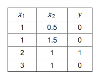
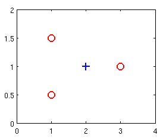
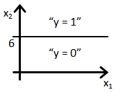
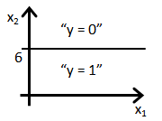
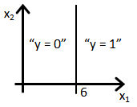
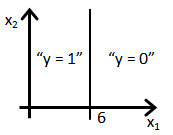

# Logistic Regression

## - 1

Suppose that you have trained a logistic regression classifier, and it outputs on a new example x a prediction $h_\theta(x)$ = 0.7. This means (check all that apply):

- [x] Our estimate for P(y=0|x;θ) is 0.3.

- [ ] Our estimate for P(y=0|x;θ) is 0.7.

- [ ] Our estimate for P(y=1|x;θ) is 0.3.

- [x] Our estimate for P(y=1|x;θ) is 0.7.

## - 2

Suppose you have the following training set, and fit a logistic regression classifier $h_\theta(x) = g(\theta_0 + \theta_1 x_1 + \theta_2 x_2)$.

Which of the following are true? Check all that apply.

- [x] Adding polynomial features (e.g., instead using $h_\theta(x) = g(\theta_0 + \theta_1x_1 + \theta_2 x_2 + \theta_3 x_1^2 + \theta_4 x_1 x_2 + \theta_5 x_2^2)$ ) could increase how well we can fit the training data.

- [x] At the optimal value of θ\thetaθ (e.g., found by fminunc), we will have $J(\theta) \geq 0$.

- [ ] Adding polynomial features (e.g., instead using $h_\theta(x) = g(\theta_0 + \theta_1x_1 + \theta_2 x_2 + \theta_3 x_1^2 + \theta_4 x_1 x_2 + \theta_5 x_2^2)$ ) would increase $J(\theta)$ because we are now summing over more terms.

- [ ] If we train gradient descent for enough iterations, for some examples $x^{(i)}$ in the training set it is possible to obtain $h_\theta(x^{(i)}) > 1$.

## - 3

For logistic regression, the gradient is given by $\frac{\partial}{\partial\theta}J(\theta) = \frac{1}{m}\sum_{i=1}^m{ (h_\theta(x^{(i)})−y^{(i)})x_j^{(i)} }$ .

Which of these is a correct gradient descent update for logistic regression with a learning rate of $\alpha$? Check all that apply.

- [x] $\theta_j := \theta_j - \alpha \frac{1}{m} \sum_{i=1}^m{ (h_\theta(x^{(i)}) - y^{(i)}) x_j^{(i)} }$ (simultaneously update for all j).

- [x] $\theta_j := \theta_j - \alpha \frac{1}{m} \sum_{i=1}^m{ \left(\frac{1}{1 + e^{-\theta^T x^{(i)}}} - y^{(i)}\right) x_j^{(i)}}$ (simultaneously update for all j).

- [ ] $\theta_j := \theta_j - \alpha \frac{1}{m} \sum_{i=1}^m{ (h_\theta(x^{(i)}) - y^{(i)}) x^{(i)}}$ (simultaneously update for all j).

- [ ] $\theta := \theta - \alpha \frac{1}{m} \sum_{i=1}^m{ \left(\theta^T x - y^{(i)}\right) x^{(i)}}$.

## - 4

Which of the following statements are true? Check all that apply.

- [x] The one-vs-all technique allows you to use logistic regression for problems in which each $y^{(i)}$ comes from a fixed, discrete set of values.

- [x] Since we train one classifier when there are two classes, we train two classifiers when there are three classes (and we do one-vs-all classification).

- [ ] For logistic regression, sometimes gradient descent will converge to a local minimum (and fail to find the global minimum). This is the reason we prefer more advanced optimization algorithms such as fminunc (conjugate gradient/BFGS/L-BFGS/etc).

- [x] The cost function $J(\theta)$ for logistic regression trained with $m \geq 1$ examples is always greater than or equal to zero.

## - 5

Suppose you train a logistic classifier $h_\theta(x) = g(\theta_0 + \theta_1x_1 + \theta_2 x_2)$. Suppose $\theta_0 = 6, \theta_1 = 0, \theta_2 = -1$. Which of the following figures represents the decision boundary found by your classifier?

Answer:

B
