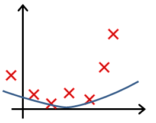
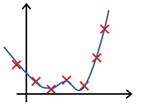
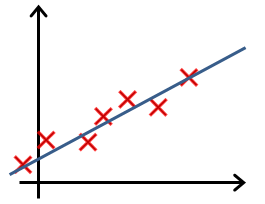
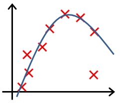
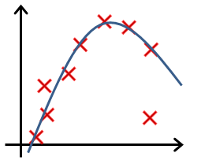
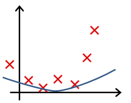
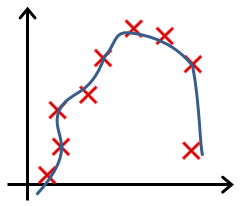
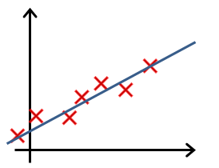

# Regularization

## - 1
You are training a classification model with logistic regression. Which of the following statements are true? check all that apply.

- [ ] Introducing regularization to the model always results in equal or better performance on the training set.

- [ ] Adding a new feature to the model always results in equal or better performance on the training set.

- [ ] Introducing regularization to the model always results in equal or better performance on examples not in the training set.

- [ ] Adding many new features to the model helps prevent overfitting on the training set.

### Answer:

- [ ] Introducing regularization to the model always results in equal or better performance on the training set.

- [x] Adding a new feature to the model always results in equal or better performance on the training set.

- [ ] Introducing regularization to the model always results in equal or better performance on examples not in the training set.

- [ ] Adding many new features to the model helps prevent overfitting on the training set.

## - 2

Suppose you ran logistic regression twice, once with $\lambda = 0$, and once with $\lambda = 1$. One of the times, you got parameters $\theta$=[81.47 12.69], and the other time you got $\theta$=[13.0 10.91]. However, you forgot which value of $\lambda$ corresponds to which value of $\theta$. Which one do you think corresponds to $\lambda = 1$?

$\theta$=[81.47 12.69]

$\theta$=[13.0 10.91]

### Answer：

$\theta$=[13.0 10.91]

## - 3

Which of the following statements about regularization are true? Check all that apply.

- [ ] Because regularization causes $J(\theta)$ to no longer be convex, gradient descent may not always converge to the global minimum (when $\lambda > 0$, and when using an appropriate learning rate α\alphaα).

- [ ] Using a very large value of $\lambda$ cannot hurt the performance of your hypothesis; the only reason we do not set $\lambda$ to be too large is to avoid numerical problems.

- [ ] Using too large a value of $\lambda$ can cause your hypothesis to underfit the data.

- [ ] Because logistic regression outputs values $0 \leq h_\theta(x) \leq 1$, its range of output values can only be "shrunk" slightly by regularization anyway, so regularization is generally not helpful for it.

### Answer:

- [ ] Because regularization causes $J(\theta)$ to no longer be convex, gradient descent may not always converge to the global minimum (when $\lambda > 0$, and when using an appropriate learning rate α\alphaα).

- [ ] Using a very large value of $\lambda$ cannot hurt the performance of your hypothesis; the only reason we do not set $\lambda$ to be too large is to avoid numerical problems.

- [x] Using too large a value of $\lambda$ can cause your hypothesis to underfit the data.

- [ ] Because logistic regression outputs values $0 \leq h_\theta(x) \leq 1$, its range of output values can only be "shrunk" slightly by regularization anyway, so regularization is generally not helpful for it.

## - 4

In which one of the following figures do you think the hypothesis has overfit the training set?

### Answer:

B

## - 5

In which one of the following figures do you think the hypothesis has underfit the training set?

### Answer:

B
