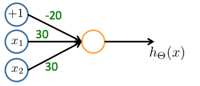
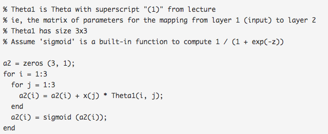

# Neural Networks: Representation

## 1

Which of the following statements are true? Check all that apply.

- [x] The activation values of the hidden units in a neural network, with the sigmoid activation function applied at every layer, are always in the range (0, 1).

- [ ] Suppose you have a multi-class classification problem with three classes, trained with a 3 layer network. Let $a^{(3)}_1={(h_\theta(x))}_1$ be the activation of the first output unit, and similarly $a^{(3)}_2={(h_\theta(x))}_2$ and $a^{(3)}_3={(h_\theta(x))}_3$. Then for any input xxx, it must be the case that $a^{(3)}_1 + a^{(3)}_2 + a^{(3)}_3 = 1$.

- [ ] A two layer (one input layer, one output layer; no hidden layer) neural network can represent the XOR function.

- [x] Any logical function over binary-valued (0 or 1) inputs x1​ and x2​ can be (approximately) represented using some neural network.

## 2

Consider the following neural network which takes two binary-valued inputs $x1,x2 \in \{0,1\}$ and outputs $h_\theta(x)$. Which of the following logical functions does it (approximately) compute?

NAND (meaning "NOT AND")

AND

OR

XOR (exclusive OR)

### Answer

OR

## 3

Consider the neural network given below. Which of the following equations correctly computes the activation $a_1^{(3)}$​? Note: g(z) is the sigmoid activation function.

$a_1^{(3)}=g(\theta_{1,0}^{(2)} a_0^{(2)} + \theta_{1,1}^{(2)} a_1^{(2)} + \theta_{1,2}^{(2)} a_2^{(2)})$

$a_1^{(3)}=g(\theta_{1,0}^{(1)} a_0^{(1)} + \theta_{1,1}^{(1)} a_1^{(1)} + \theta_{1,2}^{(1)} a_2^{(1)})$

$a_1^{(3)}=g(\theta_{1,0}^{(1)} a_0^{(2)} + \theta_{1,1}^{(1)} a_1^{(2)} + \theta_{1,2}^{(1)} a_2^{(2)})$

The activation $a_1^{(3)}$​ is not present in this network.

### Answer：

$a_1^{(3)}=g(\theta_{1,0}^{(2)} a_0^{(2)} + \theta_{1,1}^{(2)} a_1^{(2)} + \theta_{1,2}^{(2)} a_2^{(2)})$

## 4

You have the following neural network:

You'd like to compute the activations of the hidden layer $a^{(2)} \in \mathbb{R^3}$. One way to do so is the following Octave code:

You want to have a vectorized implementation of this (i.e., one that does not use for loops). Which of the following implementations correctly compute $a^{(2)}$? Check all that apply.

- [x] z = Theta1 * x; a2 = sigmoid (z);

- [ ] a2 = sigmoid (x * Theta1);

- [ ] a2 = sigmoid (Theta2 * x);

- [ ] z = sigmoid(x); a2 = sigmoid (Theta1 * z);

## 5

You are using the neural network pictured below and have learned the parameters 
$$
\theta^{(1)}=
\begin{bmatrix}
    1 & 0.5 & 1.9 \\
    1 & 1.2 & 2.7
\end{bmatrix}
$$
(used to compute $a^{(2)}$) and
$$
\theta^{(2)}=
\begin{bmatrix}
    1 & -0.2 & -1.7
\end{bmatrix}
$$
(used to compute $a^{(3)}$ as a function of $a^{(2)}$). Suppose you swap the parameters for the first hidden layer between its two units so 
$$
\theta^{(1)}=
\begin{bmatrix}
    1 & 1.2 & 2.7 \\
    1 & 0.5 & 1.9 
\end{bmatrix}
$$ 
and also swap the output layer so 
$$
\theta^{(1)}=
\begin{bmatrix}
    1 -1.7 -0.2
\end{bmatrix}
$$
How will this change the value of the output $h_\theta(x)$?

It will stay the same.

It will increase.

It will decrease

Insufficient information to tell: it may increase or decrease. 

### Answer:

It will stay the same.
