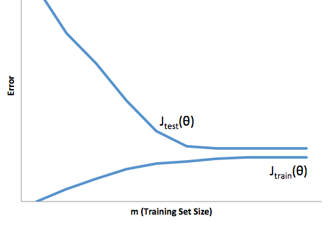

# Advice for Applying Machine Learning

## 1

You train a learning algorithm, and find that it has unacceptably high error on the test set. You plot the learning curve, and obtain the figure below. Is the algorithm suffering from high bias, high variance, or neither?

High bias

Neither

High variance

# Answer:

High bias

## 2

Suppose you have implemented regularized logistic regression to classify what object is in an image (i.e., to do object recognition). However, when you test your hypothesis on a new set of images, you find that it makes unacceptably large errors with its predictions on the new images. However, your hypothesis performs **well** (has low error) on the training set. Which of the following are promising steps to take? Check all that apply.

- [x] Try using a smaller set of features.

- [ ] Use fewer training examples.

- [x] Get more training examples.

- [ ] Try adding polynomial features.

## 3 x

Suppose you have implemented regularized logistic regression to predict what items customers will purchase on a web shopping site. However, when you test your hypothesis on a new set of customers, you find that it makes unacceptably large errors in its predictions. Furthermore, the hypothesis performs **poorly** on the training set. Which of the following might be promising steps to take? Check all that apply.

- [x] Try adding polynomial features.

- [ ] Use fewer training examples.

- [x] Try decreasing the regularization parameter $\lambda$.

- [ ] Try evaluating the hypothesis on a cross validation set rather than the test set.

## 4

Which of the following statements are true? Check all that apply.

- [ ] Suppose you are training a logistic regression classifier using polynomial features and want to select what degree polynomial (denoted ddd in the lecture videos) to use. After training the classifier on the entire training set, you decide to use a subset of the training examples as a validation set. This will work just as well as having a validation set that is separate (disjoint) from the training set.

- [x] A typical split of a dataset into training, validation and test sets might be 60% training set, 20% validation set, and 20% test set.

- [x] Suppose you are using linear regression to predict housing prices, and your dataset comes sorted in order of increasing sizes of houses. It is then important to randomly shuffle the dataset before splitting it into training, validation and test sets, so that we don’t have all the smallest houses going into the training set, and all the largest houses going into the test set.

- [ ] It is okay to use data from the test set to choose the regularization parameter λ\lambdaλ, but not the model parameters ($\theta$).

## 5 x

Which of the following statements are true? Check all that apply.

- [x] A model with more parameters is more prone to overfitting and typically has higher variance.

- [x] If a learning algorithm is suffering from high variance, adding more training examples is likely to improve the test error.

- [x] If a learning algorithm is suffering from high bias, only adding more training examples may not improve the test error significantly.

- [ ] If the training and test errors are about the same, adding more features will not help improve the results.
